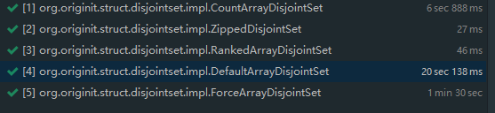

### 算法

### 数据结构
#### 1. 并查集
通过并查集可以在一个O(ma(n))（逆阿克曼函数）算法时间复杂度进行元素的插入、所在分组查找以及是否同组判定，
相当于O(1)时间复杂度
### java
#### 1. 反射获取参数为基本类型的构造方法
```java
IDisjointSet disjointSet = iDisjointSetClass.getConstructor(int.class).newInstance(9);
```
没想到int这种基本类型也能通过.class获取类型
10w数据100w次操作各个实现性能对比:

#### 2. 单元测试
通过ParameterizedTest注解可以实现参数化的测试，将数据通过参数传递
